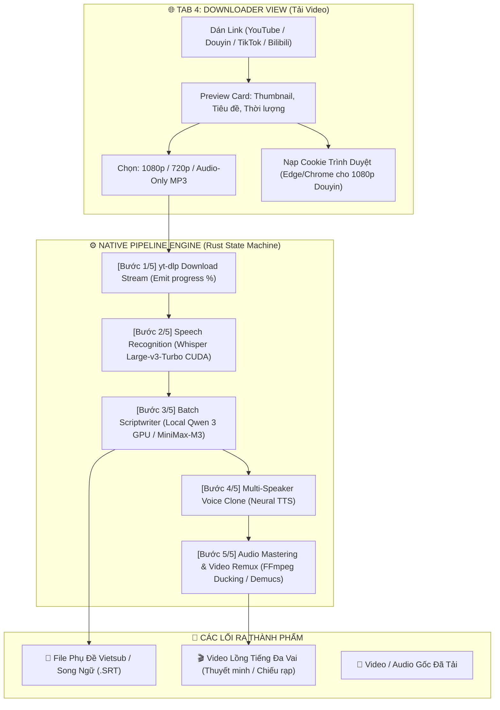

# KE_HOACH_ALL_IN_ONE_PIPELINE.md — Kế Hoạch Hệ Thống Video AI Tự Động Hóa Trọn Gói (Từ A Đến Z)

> **Tài liệu đặc tả kiến trúc & kế hoạch kỹ thuật dành riêng cho Agent Team (Antigravity & CommandCode) và Product Owner (Anh Tuấn - `jimmyvu`).**
> **Mục tiêu:** Xây dựng Tab Tải Video Đa Nền Tảng (Downloader) độc lập, kết hợp cùng **Native Pipeline Engine (Kiến trúc tự động hóa kiểu n8n viết thuần bằng Rust)** kết nối toàn bộ hệ thống từ: **Tải Video → Bóc Âm Thanh → Dịch Thuật → Lồng Tiếng Đa Vai → Xuất Video Thành Phẩm**.

---

## 🌟 1. Tầm Nhìn & Bối Cảnh (Vision & Problem Statement)

Hiện tại, Sublix đã sở hữu các khối chức năng lõi cực mạnh:
1. **STT Whisper Large-v3-Turbo CUDA**: Bóc băng giọng nói siêu tốc trên GPU RTX 3090.
2. **Local Qwen 3-4B GPU (CUDA) & MiniMax-M3**: Biên kịch và dịch thuật theo cụm (Batch Translation ~0.1s/câu).
3. **Studio Lồng Tiếng AI Đa Vai (AI Dubbing)**: Diarization phân vai, Neural TTS đa giọng điệu, Audio Ducking & Demucs v4 tách nhạc nền.
4. **File Subtitle Studio**: Tạo phụ đề rời `.srt` đơn ngữ và song ngữ.

Tuy nhiên, người dùng hiện tại vẫn phải tự tải video từ bên ngoài (qua trình duyệt/IDM), tìm file trên ổ cứng rồi mới kéo thả vào app.

### 🎯 Bước Nhảy Vọt:
Xây dựng một **Tab Tải Video Độc Lập** kết hợp **Bộ Điều Phối Quy Trình Tự Động (Native Pipeline Engine)**:
* **Đầu vào duy nhất:** Người dùng chỉ cần dán 1 đường link (YouTube, TikTok, Douyin, Bilibili, Facebook, X/Twitter, Kuaishou, Xiaohongshu...).
* **Đầu ra hoàn chỉnh:** 
  - Hoặc 1 video kèm file phụ đề Vietsub/Song ngữ `.srt`.
  - Hoặc 1 video lồng tiếng đa vai chuẩn điện ảnh/thuyết minh.
  - Hoặc cả hai (video lồng tiếng có kèm phụ đề).
* Mọi công đoạn trung gian đều được tự động hóa xuyên suốt, có thể chọn chế độ **1-Click Tự Động Hoàn Toàn** hoặc **Chế Độ Chuyên Nghiệp (Kiểm duyệt kịch bản từng bước)**.

---

## ⚖️ 2. So Sánh Kiến Trúc: Native Rust Pipeline vs n8n / Make.com

Nhiều hệ thống tự động hóa video AI trên thị trường hiện nay được dựng bằng **n8n** hoặc **Make.com**. Tuy nhiên, khi đưa vào ứng dụng Desktop Sublix, giải pháp Native Rust vượt trội hoàn toàn:

| Tiêu chí | 🌐 Hệ thống dựng bằng n8n | ⚡ Sublix Native Pipeline (Rust + Tauri) |
| :--- | :--- | :--- |
| **Kiến trúc & Cài đặt** | Cồng kềnh: Cần Node.js, Docker, Web Server, PostgreSQL | **Siêu gọn nhẹ:** Nhúng tĩnh 100% trong `sublix.exe`, 0 file rác |
| **Tận dụng GPU RTX 3090** | Khó khăn, phải gọi qua HTTP Webhook trung gian | **Native CUDA:** Gọi trực tiếp `whisper-cuda`, `llama-server` VRAM |
| **Độ trễ truyền dữ liệu** | Lâu (Upload/Download file qua các Node trung gian) | **0ms:** Truyền con trỏ bộ nhớ (RAM) và file path nội bộ |
| **Chi phí & Độ ổn định** | Phụ thuộc internet, server n8n có thể bị crash | **Chạy offline hoàn toàn** (khi dùng Local Qwen 3 GPU) |
| **Trải nghiệm người dùng** | Giao diện n8n rối rắm, người không rành code không dùng được | **Giao diện 1-Click Stepper** sang trọng, bấm 1 nút là chạy |

---

## 📋 3. Danh Sách Nền Tảng Hỗ Trợ Đầy Đủ

Tận dụng binary `yt-dlp.exe` (đã có sẵn trong máy anh Tuấn tại `C:\Program Files\AI Automation\bin\yt-dlp.exe`) và `ffmpeg.exe`.

### 🇨🇳 Nhóm 1: Hệ Sinh Thái Trung Quốc (Mỏ Vàng Kịch Ngắn, Anime, Review)
1. **Douyin (抖音)**: Video ngắn, đặc biệt là **Kịch ngắn (Mini Drama / Short Series)** đang cực kỳ viral. Tự động bóc tách và lồng tiếng tiếng Việt để đăng lại Shorts/Reels/TikTok.
2. **Bilibili (哔哩哔哩)**: Video dài, anime, bài giảng, review công nghệ. Hỗ trợ bốc tách cả phụ đề gốc (CC) của tác giả.
3. **Kuaishou (快手)**: Tiểu phẩm hài, đời sống thực tế nông thôn, video ngắn dân dã.
4. **Xiaohongshu (小红书 - RED)**: Video review thời trang, mỹ phẩm, ẩm thực, phong cách sống.
5. **Weibo Video (微博)**: Video tin tức, phỏng vấn nghệ sĩ, hậu trường giải trí.
6. **Xigua Video (西瓜视频)**: Phim tài liệu ngắn, video khoa học đời sống 5-15 phút của ByteDance.
7. **iQiyi (爱奇艺) & Youku (优酷)**: Trích đoạn phim bộ, show truyền hình thực tế.
8. **Ximalaya (喜马拉雅)**: Audio sách nói, podcast, truyện audio (rất thích hợp cho chế độ Audio-Only Dubbing).

### 🌍 Nhóm 2: Các Nền Tảng Quốc Tế & Phổ Thông
1. **YouTube & YouTube Shorts**: Hỗ trợ mọi độ phân giải (360p đến 4K), hỗ trợ trích xuất phụ đề tác giả có sẵn (Official Captions).
2. **TikTok (Quốc tế)**: Video dọc ngắn, chất lượng âm thanh gốc.
3. **Facebook & Facebook Reels**: Video bài đăng fanpage, video công khai.
4. **Instagram Reels & Video**: Clip sáng tạo, đời sống.
5. **X (Twitter)**: Video tin tức, clip thời sự nóng hổi.
6. **Reddit**: Tự động ghép luồng video và audio độc lập của Reddit thành file hoàn chỉnh.
7. **Twitch**: Clip tuyển chọn (Clips) và VODs phát lại của các streamer.

---

## 🏗️ 4. Kiến Trúc Chi Tiết: Tab Downloader & Native Pipeline Engine



---

## 💻 5. Đặc Tả Kỹ Thuật Tầng Rust (Backend State Machine)

Trong `src-tauri/src/downloader/pipeline.rs`, chúng ta xây dựng mô hình State Machine bất đồng bộ:

```rust
#[derive(Debug, Clone, Serialize, Deserialize)]
pub enum PipelineStage {
    Idle,
    Downloading { url: String, percent: f32, speed: String, eta: String },
    Transcribing { current_sec: f32, total_sec: f32, percent: f32 },
    Translating { current_batch: usize, total_batches: usize, percent: f32 },
    SynthesizingVoice { current_speaker: String, percent: f32 },
    RemuxingVideo { percent: f32 },
    Completed { output_path: String, duration_sec: f32 },
    Failed { error: String, stage_name: String },
    Cancelled,
}

#[derive(Debug, Clone, Serialize, Deserialize)]
pub struct PipelineProgressEvent {
    pub stage: PipelineStage,
    pub step_index: u8,    // 1..=5
    pub total_steps: u8,   // 5
    pub percent: f32,      // 0..=100
    pub message: String,
}
```

### Cơ Chế An Toàn & Hủy Bỏ Tức Thì (Instant Cancellation)
* Sử dụng `Arc<AtomicBool> CANCEL_TOKEN`.
* Tại mỗi bước (giữa các chunk download của `yt-dlp`, giữa các batch của Qwen 3, hoặc trong lúc FFmpeg chạy), Rust kiểm tra `cancel_token.load(Ordering::Relaxed)`.
* Nếu người dùng bấm `🛑 Dừng lại`: Tiến trình con bị kill ngay lập tức bằng `taskkill /F`, dọn sạch file tạm trong cache nội bộ.

---

## 🔒 6. Quyết Định Thiết Kế Đã Chốt (Decisions Locked - Anh Tuấn Duyệt 2026-10-04)

| Quyết định | Nội dung đã chốt | Ghi chú lộ trình (Phases) |
| :--- | :--- | :--- |
| **1. Thư mục tải về (Storage Scope)** | **Lưu trong phạm vi nội bộ của phần mềm** (`%APPDATA%/com.sublix.desktop/downloads`). Tránh xả rác ra ổ đĩa cá nhân của người dùng khi đang phát triển. | **Phase 1 (Hiện tại):** Lưu nội bộ ngầm.<br>**Phase 2 (Public Release):** Mở thêm nút chọn thư mục tùy ý (Custom Folder Picker). |
| **2. Cookie Trình duyệt (High Quality Douyin/Bilibili)** | **Có tích hợp cookie đăng nhập** để cẩu video độ nét cao nhất (1080p/4K) từ các nền tảng Trung Quốc (Douyin, Bilibili) và YouTube. | Hỗ trợ tự động trích xuất cookie từ Edge / Chrome (`--cookies-from-browser edge`) giúp video nét căng không bị bóp băng thông. |
| **3. Phụ đề rời vs Ghép chữ (Hardsub)** | **Trước mắt (Phase 1):** Tập trung xuất video gốc kèm file phụ đề rời `.srt` (Vietsub / Song ngữ) chuẩn timing.<br>**Nâng cao (Phase 2):** Nghiên cứu FFmpeg Burn-in Hardsub (ghép chữ cứng trực tiếp lên khung hình video). | **Phase 1:** File `.srt` rời chuẩn UTF-8.<br>**Phase 2:** FFmpeg Video Filter (`subtitles=...`) tùy chỉnh font chữ, màu sắc, viền bóng. |

---

## 🚀 7. Phân Kỳ Phát Triển (Phase Roadmap)

### 🟢 Phase 1: MVP Trọn Gói Tải & Dịch Video (Triển khai ngay)
1. **Backend Rust `downloader/mod.rs`**:
   - Bọc `yt-dlp.exe` có sẵn, tải video/audio về cache nội bộ app.
   - Hỗ trợ cơ chế Cookie từ trình duyệt (`--cookies-from-browser edge`).
   - Emit event tiến trình `downloader:progress`.
2. **Giao diện Tab `DownloaderView.tsx` & `.css`**:
   - Thêm tab `🌐 Tải Video` vào Sidebar.
   - Ô dán link thông minh, xem trước Thumbnail, chọn chất lượng (1080p / 720p / Audio MP3).
3. **Cầu nối tự động (Pipeline Gateways)**:
   - Tải xong $\rightarrow$ Chuyển sang **File Sub** (tạo file `.srt` Vietsub).
   - Tải xong $\rightarrow$ Chuyển sang **AI Dubbing** (lồng tiếng đa vai, audio ducking / demucs).
4. **Chế độ 1-Click Auto Pipeline**:
   - Dán link $\rightarrow$ Tích chọn *"Tự động làm từ A đến Z"* $\rightarrow$ Chạy liên tục từ Step 1 đến Step 5.

### 🟡 Phase 2: Bản Nâng Cao (Workflow Builder kiểu n8n)
1. **FFmpeg Burn-in Hardsub:** Ghép chữ cứng trực tiếp lên video với tùy chọn phong cách (Màu vàng rạp chiếu, viền đen, font chữ điện ảnh, vị trí canh lề).
2. **Workflow Recipe System:** Lưu các công thức dựng video mẫu (Ví dụ: Recipe *"Kịch Ngắn Douyin Vietsub"*, Recipe *"Podcast YouTube Thuyết Minh"*).
3. **Batch Downloader Queue:** Tải hàng loạt danh sách video / toàn bộ playlist hoặc kênh TikTok/Douyin chạy qua đêm.
4. **Bộ chọn thư mục xuất bản:** Cho phép người dùng tùy chọn lưu ra Desktop / Thư mục tải về riêng khi public ra cộng đồng.

---

## 👥 8. Phân Công Trách Nhiệm Trong Agent Team

| Agent | Nhiệm vụ chính | Output bàn giao |
| :--- | :--- | :--- |
| **Antigravity** | Xây dựng Backend Rust `downloader/mod.rs`, Tauri commands, Frontend UI `DownloaderView.tsx`, CSS Glassmorphism, Navigation Bridge chuyển tab | Code backend + frontend hoàn chỉnh, test build release |
| **CommandCode** | Review kiến trúc, audit luồng hủy tiến trình (Job Object cho yt-dlp), kiểm tra regex stdout progress, bảo mật cookie path | Báo cáo review, đóng góp fix code nếu có lỗ hổng |
| **Anh Tuấn (`jimmyvu`)** | Product Owner, kiểm thử thực tế trên các link Douyin, YouTube, TikTok yêu thích | Đánh giá UX, nghiệm thu tính năng |

---

## 🔍 9. Khu Vực Dành Riêng Cho CommandCode Đánh Giá (Reviewer Section)

Kính mời **CommandCode** vào kiểm tra và đóng góp ý kiến cho các câu hỏi kỹ thuật sau:
1. **Regex phân tích tiến trình stdout của `yt-dlp`:** Chúng ta nên dùng regex parse trực tiếp stdout hay dùng cờ `--progress-template "%(progress._percent_str)s %(progress._speed_str)s %(progress._eta_str)s"` để parse JSON/chuẩn định dạng an toàn hơn?
2. **Cơ chế Cookie:** Khi gọi `--cookies-from-browser edge`, trên Windows có cần lưu ý quyền truy cập file SQLite cookie của Edge nếu trình duyệt đang mở không? (Có cần copy file cookie tạm thời trước khi đọc?).
3. **Quản lý Process Tree:** Đảm bảo khi kill `yt-dlp` thì không để lại tiến trình ma `ffmpeg` đang remux dở.

---

*Tài liệu được cập nhật chính thức vào Git repo `master` ngày 2026-10-04. Sẵn sàng cho review và triển khai!*
