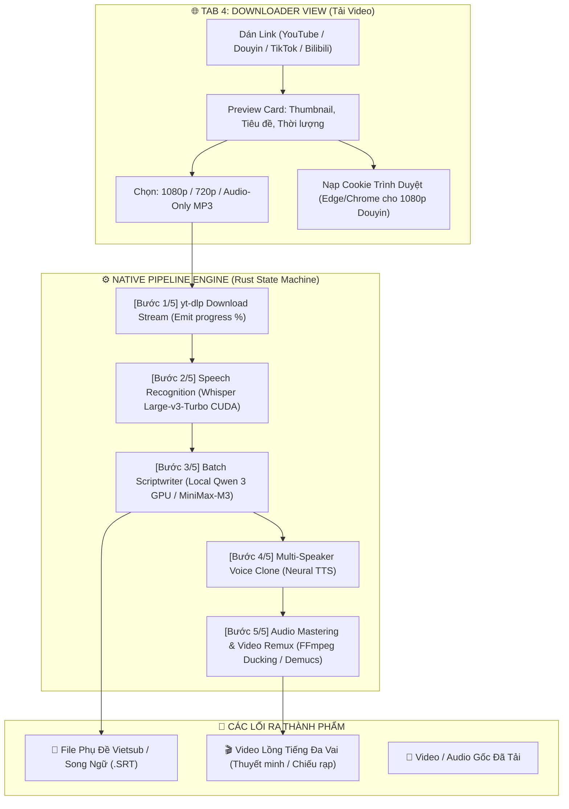

# KE_HOACH_ALL_IN_ONE_PIPELINE.md — Kế Hoạch Hệ Thống Video AI Tự Động Hóa Trọn Gói (Từ A Đến Z)

> **Tài liệu đặc tả kiến trúc & kế hoạch kỹ thuật dành riêng cho Agent Team (Antigravity & CommandCode) và Product Owner (Anh Tuấn - `jimmyvu`).**
> **Mục tiêu:** Xây dựng Tab Tải Video Đa Nền Tảng (Downloader) độc lập, kết hợp cùng **Native Pipeline Engine (Kiến trúc tự động hóa kiểu n8n viết thuần bằng Rust)** kết nối toàn bộ hệ thống từ: **Tải Video → Bóc Âm Thanh → Dịch Thuật → Lồng Tiếng Đa Vai → Xuất Video Thành Phẩm**.

---

## 🌟 1. Tầm Nhìn & Bối Cảnh (Vision & Problem Statement)

Hiện tại, Sublix đã sở hữu các khối chức năng lõi cực mạnh:
1. **STT Whisper Large-v3-Turbo CUDA**: Bóc băng giọng nói siêu tốc trên GPU RTX 3090.
2. **Local Qwen 3-4B GPU (CUDA) & MiniMax-M3**: Biên kịch và dịch thuật theo cụm (Batch Translation ~0.1s/câu).
3. **Studio Lồng Tiếng AI Đa Vai (AI Dubbing)**: Diarization phân vai, Neural TTS đa giọng điệu, Audio Ducking & Demucs v4 tách nhạc nền.
4. **File Subtitle Studio**: Tạo phụ đề rời `.srt` đơn ngữ và song ngữ.

Tuy nhiên, người dùng hiện tại vẫn phải tự tải video từ bên ngoài (qua trình duyệt/IDM), tìm file trên ổ cứng rồi mới kéo thả vào app.

### 🎯 Bước Nhảy Vọt:
Xây dựng một **Tab Tải Video Độc Lập** kết hợp **Bộ Điều Phối Quy Trình Tự Động (Native Pipeline Engine)**:
* **Đầu vào duy nhất:** Người dùng chỉ cần dán 1 đường link (YouTube, TikTok, Douyin, Bilibili, Facebook, X/Twitter, Kuaishou, Xiaohongshu...).
* **Đầu ra hoàn chỉnh:** 
  - Hoặc 1 video kèm file phụ đề Vietsub/Song ngữ `.srt`.
  - Hoặc 1 video lồng tiếng đa vai chuẩn điện ảnh/thuyết minh.
  - Hoặc cả hai (video lồng tiếng có kèm phụ đề).
* Mọi công đoạn trung gian đều được tự động hóa xuyên suốt, có thể chọn chế độ **1-Click Tự Động Hoàn Toàn** hoặc **Chế Độ Chuyên Nghiệp (Kiểm duyệt kịch bản từng bước)**.

---

## ⚖️ 2. So Sánh Kiến Trúc: Native Rust Pipeline vs n8n / Make.com

Nhiều hệ thống tự động hóa video AI trên thị trường hiện nay được dựng bằng **n8n** hoặc **Make.com**. Tuy nhiên, khi đưa vào ứng dụng Desktop Sublix, giải pháp Native Rust vượt trội hoàn toàn:

| Tiêu chí | 🌐 Hệ thống dựng bằng n8n | ⚡ Sublix Native Pipeline (Rust + Tauri) |
| :--- | :--- | :--- |
| **Kiến trúc & Cài đặt** | Cồng kềnh: Cần Node.js, Docker, Web Server, PostgreSQL | **Siêu gọn nhẹ:** Nhúng tĩnh 100% trong `sublix.exe`, 0 file rác |
| **Tận dụng GPU RTX 3090** | Khó khăn, phải gọi qua HTTP Webhook trung gian | **Native CUDA:** Gọi trực tiếp `whisper-cuda`, `llama-server` VRAM |
| **Độ trễ truyền dữ liệu** | Lâu (Upload/Download file qua các Node trung gian) | **0ms:** Truyền con trỏ bộ nhớ (RAM) và file path nội bộ |
| **Chi phí & Độ ổn định** | Phụ thuộc internet, server n8n có thể bị crash | **Chạy offline hoàn toàn** (khi dùng Local Qwen 3 GPU) |
| **Trải nghiệm người dùng** | Giao diện n8n rối rắm, người không rành code không dùng được | **Giao diện 1-Click Stepper** sang trọng, bấm 1 nút là chạy |

---

## 📋 3. Danh Sách Nền Tảng Hỗ Trợ Đầy Đủ

Sử dụng công cụ tải video `yt-dlp.exe` và `ffmpeg.exe` (tìm theo PATH hoặc thư mục kèm app — **KHÔNG hardcode đường dẫn máy cá nhân**, xem Mục 10).

> **⚠️ Phạm vi Phase 1 (điều chỉnh sau review):** chỉ làm trước **3 nền tảng: YouTube, TikTok, Douyin** cho thật chắc. Danh sách 15+ nền tảng dưới đây là **mục tiêu Phase 2** — mở rộng dần khi 3 nền đầu chạy ổn định.
>
> **⚠️ Nền tảng Trung Quốc hay chặn:** khi tải thất bại do bị chặn / thiếu đăng nhập / hết lượt, app phải **nói đúng nguyên nhân** ("Video này yêu cầu đăng nhập trình duyệt", "Bị chặn khu vực") kèm gợi ý xử lý — **cấm báo lỗi chung chung** hay im lặng bỏ qua.

### 🇨🇳 Nhóm 1: Hệ Sinh Thái Trung Quốc (Mỏ Vàng Kịch Ngắn, Anime, Review)
1. **Douyin (抖音)**: Video ngắn, đặc biệt là **Kịch ngắn (Mini Drama / Short Series)** đang cực kỳ viral. Tự động bóc tách và lồng tiếng tiếng Việt để đăng lại Shorts/Reels/TikTok.
2. **Bilibili (哔哩哔哩)**: Video dài, anime, bài giảng, review công nghệ. Hỗ trợ bốc tách cả phụ đề gốc (CC) của tác giả.
3. **Kuaishou (快手)**: Tiểu phẩm hài, đời sống thực tế nông thôn, video ngắn dân dã.
4. **Xiaohongshu (小红书 - RED)**: Video review thời trang, mỹ phẩm, ẩm thực, phong cách sống.
5. **Weibo Video (微博)**: Video tin tức, phỏng vấn nghệ sĩ, hậu trường giải trí.
6. **Xigua Video (西瓜视频)**: Phim tài liệu ngắn, video khoa học đời sống 5-15 phút của ByteDance.
7. **iQiyi (爱奇艺) & Youku (优酷)**: Trích đoạn phim bộ, show truyền hình thực tế.
8. **Ximalaya (喜马拉雅)**: Audio sách nói, podcast, truyện audio (rất thích hợp cho chế độ Audio-Only Dubbing).

### 🌍 Nhóm 2: Các Nền Tảng Quốc Tế & Phổ Thông
1. **YouTube & YouTube Shorts**: Hỗ trợ mọi độ phân giải (360p đến 4K), hỗ trợ trích xuất phụ đề tác giả có sẵn (Official Captions).
2. **TikTok (Quốc tế)**: Video dọc ngắn, chất lượng âm thanh gốc.
3. **Facebook & Facebook Reels**: Video bài đăng fanpage, video công khai.
4. **Instagram Reels & Video**: Clip sáng tạo, đời sống.
5. **X (Twitter)**: Video tin tức, clip thời sự nóng hổi.
6. **Reddit**: Tự động ghép luồng video và audio độc lập của Reddit thành file hoàn chỉnh.
7. **Twitch**: Clip tuyển chọn (Clips) và VODs phát lại của các streamer.

---

## 🏗️ 4. Kiến Trúc Chi Tiết: Tab Downloader & Native Pipeline Engine



---

## 💻 5. Đặc Tả Kỹ Thuật Tầng Rust (Backend State Machine)

Trong `src-tauri/src/downloader/pipeline.rs`, chúng ta xây dựng mô hình State Machine bất đồng bộ:

```rust
#[derive(Debug, Clone, Serialize, Deserialize)]
pub enum PipelineStage {
    Idle,
    Downloading { url: String, percent: f32, speed: String, eta: String },
    Transcribing { current_sec: f32, total_sec: f32, percent: f32 },
    Translating { current_batch: usize, total_batches: usize, percent: f32 },
    SynthesizingVoice { current_speaker: String, percent: f32 },
    RemuxingVideo { percent: f32 },
    Completed { output_path: String, duration_sec: f32 },
    Failed { error: String, stage_name: String },
    Cancelled,
}

#[derive(Debug, Clone, Serialize, Deserialize)]
pub struct PipelineProgressEvent {
    pub stage: PipelineStage,
    pub step_index: u8,    // 1..=5
    pub total_steps: u8,   // 5
    pub percent: f32,      // 0..=100
    pub message: String,
}
```

### Cơ Chế An Toàn & Hủy Bỏ Tức Thì (Instant Cancellation)
* Sử dụng `Arc<AtomicBool> CANCEL_TOKEN`.
* Tại mỗi bước (giữa các chunk download của `yt-dlp`, giữa các batch của Qwen 3, hoặc trong lúc FFmpeg chạy), Rust kiểm tra `cancel_token.load(Ordering::Relaxed)`.
* Nếu người dùng bấm `🛑 Dừng lại`: Tiến trình con bị kill ngay lập tức bằng `taskkill /F`, dọn sạch file tạm trong cache nội bộ.

---

## 🔒 6. Quyết Định Thiết Kế Đã Chốt (Decisions Locked - Anh Tuấn Duyệt 2026-10-04)

| Quyết định | Nội dung đã chốt | Ghi chú lộ trình (Phases) |
| :--- | :--- | :--- |
| **1. Thư mục tải về (Storage Scope)** | **Lưu trong phạm vi nội bộ của phần mềm** (`%APPDATA%/com.sublix.desktop/downloads`). Tránh xả rác ra ổ đĩa cá nhân của người dùng khi đang phát triển. | **Phase 1 (Hiện tại):** Lưu nội bộ ngầm.<br>**Phase 2 (Public Release):** Mở thêm nút chọn thư mục tùy ý (Custom Folder Picker). |
| **2. Cookie Trình Duyệt (High Quality Douyin/Bilibili/YouTube)** | **Có tích hợp cookie đăng nhập** để tải video độ nét cao nhất (1080p/4K). **Điều chỉnh sau review:** cho người dùng **tự chọn trình duyệt** (Edge / Chrome / Firefox) trong cài đặt — không hardcode một trình duyệt (hermes đang hardcode Firefox). | Tự trích xuất cookie từ trình duyệt người dùng chọn (`--cookies-from-browser <browser>`); có đường dự phòng nhập file `cookies.txt` khi trình duyệt mới mã hóa không đọc được (Mục 10 câu 2). |
| **3. Phụ đề rời vs Ghép chữ (Hardsub)** | **Trước mắt (Phase 1):** Tập trung xuất video gốc kèm file phụ đề rời `.srt` (Vietsub / Song ngữ) chuẩn timing.<br>**Nâng cao (Phase 2):** Nghiên cứu FFmpeg Burn-in Hardsub (ghép chữ cứng trực tiếp lên khung hình video). | **Phase 1:** File `.srt` rời chuẩn UTF-8.<br>**Phase 2:** FFmpeg Video Filter (`subtitles=...`) tùy chỉnh font chữ, màu sắc, viền bóng. |
| **4. Bản quyền & Trách Nhiệm (bổ sung sau review CommandCode)** | Trên màn hình Tải Video luôn có ghi chú: *"Chỉ tải và sử dụng nội dung bạn có quyền — khi đăng lại video đã lồng tiếng, người dùng tự chịu trách nhiệm về bản quyền và điều khoản nền tảng."* | Áp dụng ngay Phase 1. |
| **5. Chất Lượng YouTube (chốt sau review Mục 12)** | **Phase 1 — Phương án Đơn giản:** chỉ dùng cờ cơ bản của yt-dlp, **không cài thêm gì** ngoài app. Chất lượng có thể thấp hơn mong đợi — UI phải **nói thật** lý do.<br>**Phase 3 — Phương án Đầy đủ:** nếu cần nét cao thì mới mang hệ thống hỗ trợ từ hermes (Deno + trình giải câu đố + server "vé" bgutil — xem Mục 12.A.3), chấp nhận cài thêm linh kiện. | Người dùng không bao giờ bị bất ngờ: chất lượng tải được phải hiển thị trung thực trên UI. |

---

## 🚀 7. Phân Kỳ Phát Triển (Phase Roadmap)

### 🟠 Phase 0: Chữa Nền Móng (BẮT BUỘC — hoàn thành trước Phase 1)

Kế hoạch mới xây trên chính pipeline lồng tiếng hiện tại, mà phần này **đang có lỗi làm hỏng đầu ra**. Xây nhà trên nền nứt thì nhà mới cũng nứt — nên Phase 0 sửa trước:

1. **Sửa âm thanh:** `BUG-026` (phim dài quá ~900 câu là hỏng export) + `BUG-030` (âm lượng lúc to lúc nhỏ bất thường).
2. **Sửa việc "Dừng lại":** `BUG-027` + `BUG-028` + `BUG-041` — bấm Dừng là dừng ngay thật sự, không chạy lén tiếp, không bị 2 công việc giẫm nhau.
3. **Hỏng là phải la lên:** `BUG-029` — dịch lỗi mà âm thầm lồng tiếng gốc vào video là lỗi nguy hiểm nhất, cấm im lặng.
4. **Sửa File Studio:** `BUG-031` + `BUG-032` — đổi tab không mất việc, không nhân đôi dữ liệu, đang chạy mà thả file mới không làm hỏng tiến độ.

**Tiêu chí nghiệm thu Phase 0:** xuất thử 1 phim dài >900 câu; bấm Dừng thử ở **mọi** giai đoạn (tách giọng, dịch, lồng, ghép video) thấy dừng ngay; rút mạng giữa chừng thấy app **báo lỗi rõ ràng**; không có sản phẩm sai nào được sinh ra mà không cảnh báo.

### 🟢 Phase 1: Tab Tải Video (3 nền tảng: YouTube, TikTok, Douyin)

**Việc cần làm:**
1. **Backend Rust `downloader/mod.rs`:**
   - Bọc `yt-dlp.exe` (tìm theo PATH → thư mục cạnh app → đường dẫn người dùng chỉ — Mục 10 & 12).
   - Nhận diện nền tảng + bộ cờ chọn chất lượng **kế thừa từ `hermes-downloader`** (Mục 12.A).
   - **Tải tiếp khi mạng rớt (resume)** — kế thừa cơ chế của hermes: file tải dở được tải tiếp từ chỗ dừng, không bao giờ tải lại từ đầu.
   - Cookie trình duyệt: **cho người dùng chọn trình duyệt** (Edge / Chrome / Firefox), không hardcode một trình duyệt.
   - Kiểm tra dung lượng ổ đĩa trước khi tải; emit tiến trình `downloader:progress` (tốc độ, thời gian còn lại — định dạng tiếng Việt kế thừa Mục 12.B).
2. **Giao diện Tab `🌐 Tải Video` (`DownloaderView.tsx`):** ô dán link, thẻ xem trước (thumbnail, tiêu đề, thời lượng), chọn chất lượng (1080p / 720p / Audio MP3), thanh tiến trình.
3. **Chính sách "hỏng thì làm sao" (BẮT BUỘC):** lỗi hiện **đúng nguyên nhân** + nút "Thử lại"; cấm im lặng bỏ qua hay thay thế kết quả sai.
4. **Ghi chú bản quyền** trên màn hình Tải Video (Quyết định số 4).
5. **Chất lượng YouTube — nói thật:** Phase 1 dùng **Phương án Đơn giản** (Quyết định số 5); nếu chỉ tải được chất lượng thấp hơn mong đợi thì UI phải ghi rõ lý do.

**Tiêu chí nghiệm thu Phase 1 (Thẩm định):**
- [ ] Dán link YouTube / TikTok / Douyin → hiện đúng thumbnail + tiêu đề + thời lượng trong vài giây
- [ ] Tải xong: file mở xem được, nằm trong thư mục nội bộ của app, tên file sạch sẽ
- [ ] Ngắt mạng giữa chừng rồi bật lại → **tải tiếp từ chỗ dở**, không tải lại từ đầu
- [ ] Link chết / bị chặn / thiếu cookie → hiện **đúng nguyên nhân** kèm gợi ý xử lý (test với 1 link bị chặn thật)
- [ ] Ổ cứng gần đầy → từ chối tải ngay từ đầu với thông báo rõ ràng
- [ ] YouTube đạt 720p trở lên khi máy có đăng nhập trình duyệt; nếu không đạt, UI ghi rõ lý do
- [ ] Ghi chú bản quyền hiển thị trên màn hình Tải Video
- [ ] Bấm Dừng lúc đang tải → dừng ngay, không còn tiến trình tải nào chạy ngầm (kiểm tra Task Manager)

### 🟡 Phase 2: Cầu Nối Tự Động & Chế Độ 1-Click A→Z

**Việc cần làm:**
0. **Hình thức giao diện đã chốt (Anh Tuấn & CommandCode):** KHÔNG xây bảng nối dây kiểu ComfyUI. Làm theo kiểu **"Máy giặt 5 bước" + Công thức gói sẵn**:
   - Trước khi chạy: chọn **Công thức** trong danh sách thả xuống (*"Kịch ngắn Douyin → Vietsub"*, *"Podcast YouTube → Thuyết minh"*, *"Phim lẻ → Lồng tiếng + phụ đề"*), rồi **tích vào ô** các tùy chọn muốn bật (thêm phụ đề gốc, thêm lồng tiếng, tách nhạc nền...) — không tích là không làm.
   - Trong khi chạy: hiện 1 chuỗi 5 bước thẳng (Tải → Nghe → Dịch → Lồng → Ghép video), hỏng bước nào thấy ngay bước đó.
   - Ai muốn chỉnh sâu: danh sách bước đánh dấu tick (bỏ/thêm bước, đổi cài đặt) — **vẫn là danh sách, không phải bảng dây**. Lý do: ít lựa chọn thì ô tích là đủ, bảng nối dây chỉ thêm chỗ hỏng mà thôi.
1. **Cầu nối tự động (Pipeline Gateways):** Tải xong → 1 nút chuyển sang **File Sub** (tạo `.srt` Vietsub) hoặc **AI Dubbing** (lồng tiếng đa vai).
2. **Chế độ 1-Click:** dán link → tích *"Tự động làm từ A đến Z"* → chạy liên tục: Tải → Nhận dạng → Dịch → (tùy chọn) Lồng tiếng → Xuất thành phẩm.
3. **Nút Dừng thật sự:** dừng ngay ở mọi bước, diệt cả tiến trình con lẫn cháu (Mục 10 câu 3), dọn sạch file tạm.
4. **Ghi nhớ việc dở dang:** tắt app giữa chừng, mở lại thấy "đang có việc dở" và chọn chạy tiếp hay hủy — không mất trắng.

**Tiêu chí nghiệm thu Phase 2 (Thẩm định):**
- [ ] Dán 1 link video ngắn → bấm 1 nút → ra file phụ đề Việt trong một lần chạy, không cần đụng tay bước nào
- [ ] Chọn thêm lồng tiếng → ra video lồng tiếng hoàn chỉnh
- [ ] Bấm Dừng thử ở **từng bước** (đang tải / nhận dạng / dịch / lồng / ghép video) → dừng ngay dưới 2 giây, không còn tiến trình chạy ngầm
- [ ] Rút mạng khi đang dịch → hiện đúng lỗi + 2 nút "Thử lại" / "Chạy tiếp từ bước sau", không sinh ra sản phẩm sai nào
- [ ] Tắt app giữa chừng → mở lại thấy việc dở dang, chạy tiếp không mất dữ liệu đã làm
- [ ] Xuất thử 1 phim dài >900 câu thoại: thành công, âm lượng đều (không lúc to lúc nhỏ)

### 🟠 Phase 3: Mở Rộng & Nâng Cấp (làm khi Phase 2 chạy ổn định)

**Việc cần làm:**
1. **Mở rộng nền tảng còn lại** (Mục 3): Bilibili, Kuaishou, Xiaohongshu, Weibo, Xigua, iQiyi/Youku, Ximalaya, Facebook, Instagram, X, Reddit, Twitch.
2. **Chất lượng YouTube cao — Phương án Đầy đủ** (Quyết định số 5): mang hệ thống hỗ trợ từ hermes (Deno + trình giải câu đố + server "vé" bgutil) nếu Phase 1 chưa đạt nét mong muốn.
3. **Ghép chữ cứng vào video (Hardsub)** với tùy chỉnh font / màu / viền / vị trí (Quyết định số 3).
4. **Tải hàng loạt** playlist hoặc kênh chạy qua đêm; **Recipe** — công thức dựng video mẫu.
5. **Chọn thư mục xuất bản** tự do (Quyết định số 1).
6. *(Tùy chọn)* Kế thừa thêm của hermes nếu thấy cần: bắt link từ clipboard, extension bắt video trong trang, tải torrent.

**Tiêu chí nghiệm thu Phase 3 (Thẩm định):**
- [ ] Mỗi nền tảng mới: ít nhất 1 test tải thành công thực tế + 1 test lỗi có thông báo đúng nguyên nhân
- [ ] YouTube đạt 1080p trở lên trên máy sạch (không cần cài gì ngoài app) nếu làm Phương án Đầy đủ
- [ ] Hardsub: video xuất ra có chữ đúng font / màu / viền đã chọn, đọc rõ trên cả nền sáng lẫn nền tối
- [ ] Tải hàng loạt 10 video qua đêm: sáng ra đủ 10 file; file nào fail thì ghi rõ cái nào và vì sao
- [ ] Recipe: lưu công thức → áp dụng cho link khác → cho ra cùng cấu trúc đầu ra

---

> **📌 BẢNG THẨM ĐỊNH TỔNG:** Mỗi phase nghiệm thu riêng bằng đúng bảng tiêu chí ở trên. Xong 1 phase thì người nghiệm thu (Anh Tuấn) tick từng mục và ghi nhận vào `PROJECT_STATE.md`. **Chưa tick hết tiêu chí phase trước thì không mở phase sau.**

---

## 👥 8. Phân Công Trách Nhiệm Trong Agent Team

| Agent | Nhiệm vụ chính | Output bàn giao |
| :--- | :--- | :--- |
| **Antigravity** | Xây dựng Backend Rust `downloader/mod.rs`, Tauri commands, Frontend UI `DownloaderView.tsx`, CSS Glassmorphism, Navigation Bridge chuyển tab | Code backend + frontend hoàn chỉnh, test build release |
| **CommandCode** | Review kiến trúc, audit luồng hủy tiến trình (Job Object cho yt-dlp), kiểm tra regex stdout progress, bảo mật cookie path | Báo cáo review, đóng góp fix code nếu có lỗ hổng |
| **Anh Tuấn (`jimmyvu`)** | Product Owner, kiểm thử thực tế trên các link Douyin, YouTube, TikTok yêu thích | Đánh giá UX, nghiệm thu tính năng |

---

## 🔍 9. Khu Vực Dành Riêng Cho CommandCode Đánh Giá (Reviewer Section)

Kính mời **CommandCode** vào kiểm tra và đóng góp ý kiến cho các câu hỏi kỹ thuật sau:
1. **Regex phân tích tiến trình stdout của `yt-dlp`:** Chúng ta nên dùng regex parse trực tiếp stdout hay dùng cờ `--progress-template "%(progress._percent_str)s %(progress._speed_str)s %(progress._eta_str)s"` để parse JSON/chuẩn định dạng an toàn hơn?
2. **Cơ chế Cookie:** Khi gọi `--cookies-from-browser edge`, trên Windows có cần lưu ý quyền truy cập file SQLite cookie của Edge nếu trình duyệt đang mở không? (Có cần copy file cookie tạm thời trước khi đọc?).
3. **Quản lý Process Tree:** Đảm bảo khi kill `yt-dlp` thì không để lại tiến trình ma `ffmpeg` đang remux dở.

---

## 🧑‍⚖️ 10. Review Của CommandCode (2026-10-04)

**Kết luận:** Kế hoạch **đúng hướng và nên làm** — Native Rust là lựa chọn chuẩn cho desktop, State Machine rõ ràng, 3 quyết định đã chốt (storage nội bộ → Phase 2 mở rộng, cookie trình duyệt, SRT rời trước – hardsub sau) đều hợp lý. Có **4 điểm bắt buộc bổ sung trước khi code Phase 1**:

1. **KHÔNG lặp lại thiết kế hủy tiến trình cũ:** Mục 5 mô tả `Arc<AtomicBool> CANCEL_TOKEN` + `taskkill /F` — đúng y pattern vừa gây `BUG-027`/`BUG-028` và `BUG-003`. Thay bằng **run-generation (`AtomicU64`) + Windows Job Object `KILL_ON_JOB_CLOSE`** cho mọi tiến trình con (lưu ý: `yt-dlp` kéo theo cả `ffmpeg` bên trong).
2. **Bỏ đường dẫn hardcode `C:\Program Files\AI Automation\bin\yt-dlp.exe` (Mục 3):** lặp lại `BUG-001`/`BUG-017`. Resolve theo thứ tự: PATH → thư mục cạnh `sublix.exe` (đóng gói kèm bản portable) → config do người dùng chỉ.
3. **Chính sách vận hành Phase 1 cần đủ:** dọn cache `downloads/` (giới hạn dung lượng/tuổi file), kiểm tra dung lượng đĩa trước khi tải 4K, cho phép resume tải dở (`.part` của yt-dlp), chính sách lỗi từng bước của 1-Click (dừng hay bỏ qua bước hỏng), và **ghi chú pháp lý trong UI**: chỉ tải nội dung người dùng có quyền sử dụng (điều khoản nền tảng & bản quyền).
4. **State Machine nên thêm:** `Retrying { attempt, max }` và **ghi state xuống đĩa** để app crash/restart vẫn biết job nào đang dở; trước khi Step 5 dùng lại Dubbing export cần fix `BUG-026`/`BUG-030` (amix) và `BUG-029` (fallback dịch lồng tiếng gốc).

### Trả lời 3 câu hỏi kỹ thuật (Mục 9)
1. **Parse tiến trình yt-dlp:** Dùng `--newline --no-ansi --progress-template "download:%(progress.downloaded_bytes)s|%(progress.total_bytes)s|%(progress.total_bytes_estimate)s|%(progress.speed)s|%(progress.eta)s"` rồi tách theo ký tự phân cách — **KHÔNG regex stdout chữ tự do** và tránh `%(progress._percent_str)s` (chứa ANSI/khoảng trắng, đổi theo version). Tự tính `%` từ byte để UI ổn định.
2. **Cookie trình duyệt:** (a) file SQLite `Cookies` của Edge bị khóa WAL khi trình duyệt đang mở → copy `Cookies` + `-wal` + `-shm` về thư mục tạm trước khi đọc; (b) Edge/Chrome bản mới dùng **App-Bound Encryption** khiến giải mã cookie thất bại trên một số máy → bắt buộc có đường fallback `--cookies cookies.txt` (Netscape, người dùng export từ extension) và báo lỗi rõ ràng; (c) cookie = toàn quyền tài khoản → chỉ lưu trong `%APPDATA%` nội bộ app, không log, không upload.
3. **Quản lý cây tiến trình:** `yt-dlp` spawn `ffmpeg` (ghép H.264+AAC) — kill `yt-dlp` vẫn để lại `ffmpeg` mồ côi. Bắt buộc đưa cả cây vào **Windows Job Object `KILL_ON_JOB_CLOSE`** (giống giải pháp `BUG-002`); phương án dự phòng `taskkill /PID <pid> /T /F` (giết cây theo PID — **cấm `/IM` theo tên**, `BUG-003`). Tuyệt đối không dùng `taskkill /F` mù như đề xuất ban đầu của Mục 5.

---

## ✅ 11. Danh Sách Việc Antigravity Cần Làm (làm đúng theo thứ tự — mỗi bước xong là nghiệm thu luôn)

1. **Phase 0 — Chữa nền móng** (Mục 7): sửa `BUG-026`, `BUG-030`, `BUG-027`, `BUG-028`, `BUG-041`, `BUG-029`, `BUG-031`, `BUG-032` (chi tiết `ISSUE_LOG.md`). **Tick hết tiêu chí Phase 0 mới được qua Phase 1.**
2. **Phase 1 — Tab Tải Video** (Mục 7 Phase 1): 3 nền tảng YouTube, TikTok, Douyin; có resume khi mạng rớt; cookie cho người dùng chọn trình duyệt; ghi chú bản quyền. Kỹ thuật xem Mục 5 + Mục 10 + kế thừa `hermes-downloader` (Mục 12). **Nghiệm thu bằng bảng Phase 1.**
3. **Phase 2 — Cầu nối & 1-Click A→Z** (Mục 7 Phase 2): nối Tải → File Sub → Lồng tiếng, nút Dừng thật sự (Job Object — Mục 10 câu 3), ghi nhớ việc dở dang. **Nghiệm thu bằng bảng Phase 2.**
4. **Phase 3 — Mở rộng** (Mục 7 Phase 3): các nền còn lại, YouTube nét cao (Phương án Đầy đủ — Quyết định số 5), hardsub, tải hàng loạt, recipe. **Chỉ bắt đầu khi Phase 2 chạy ổn định.**

**Luật chung khi code:** mọi tiến trình con phải sống chết theo app (Job Object); mọi hỏng hóc phải hiện lên màn hình; **cấm im lặng** bỏ qua hoặc thay thế kết quả sai mà không báo; mỗi phase xong phải tick tiêu chí nghiệm thu trước khi mở phase sau.

---

## 💎 12. Kế Thừa & Tái Sử Dụng Mã Nguồn Từ `hermes-downloader` (Tiết Kiệm 80% Công Sức)

Theo phát hiện và chỉ đạo của anh Tuấn, trong thư mục `H:\AI Project\hermes-downloader` đã có sẵn một dự án Downloader hoàn chỉnh và đã được kiểm thử thực tế. Thay vì viết lại từ đầu 100%, chúng ta sẽ **kế thừa trực tiếp các tài sản quý giá sau**:

### A. Tầng Logic & Tham Số `yt-dlp` (Chuyển thể sang Rust):
1. **Bộ nhận diện nền tảng (`getPlatform` trong `hermes-downloader/main.js:89-106`):**
   - Đã có sẵn toàn bộ regex nhận diện chuẩn xác: YouTube, TikTok, Facebook, X (Twitter), Instagram, Vimeo, SoundCloud, Reddit, Twitch, Bilibili...
   - Chuyển thẳng regex này sang hàm Rust `detect_platform(url: &str) -> Platform`.
2. **Bộ tham số định dạng (`buildFormatArgs` trong `hermes-downloader/main.js:418-429`):**
   - Đã tinh chỉnh cờ format tối ưu:
     - `audio-mp3`: `["-x", "--audio-format", "mp3", "--audio-quality", "0"]`
     - `audio-m4a`: `["-x", "--audio-format", "m4a", "--audio-quality", "0"]`
     - `720p`: `["-f", "best[height<=720]/best"]`
     - `1080p`: `["-f", "best[height<=1080]/best"]`
     - `4K`: `["-f", "best[height>=2160]/best[height>=1440]/best"]`
3. **Bộ cờ YouTube (`main.js:619-659`) — ĐỌC KỸ TRƯỚC KHI DÙNG (bổ sung sau review):**
   - *Cờ đơn giản (dùng ngay Phase 1 — Phương án Đơn giản, Quyết định số 5):* `--extractor-args youtube:player_client=web_safari,android_vr,ios` (né bóp băng thông) + `--merge-output-format mp4` (ép ghép video H.264 + audio AAC vào MP4).
   - *Phần "hậu cần" khó mà bản kế hoạch trước đã quên:* để tải YouTube **nét cao**, hermes còn dùng thêm `--js-runtimes deno` + `--remote-components ejs:github` (bắt buộc cài thêm Deno và tải trình giải "câu đố" của YouTube từ mạng về), một server riêng `bgutil-server/` để tạo "vé" (PO Token), và đăng nhập sẵn trình duyệt (`--cookies-from-browser firefox`).
   - **Đã chốt (Quyết định số 5):** Phase 1 chỉ dùng cờ đơn giản, chất lượng hiển thị trung thực trên UI. Phase 3 nếu cần nét cao mới mang trọn hệ thống hỗ trợ trên sang.
4. **Bộ cờ trích xuất phụ đề tự động (`main.js:642-649`):**
   - `--write-subs --write-auto-subs --convert-subs srt --sub-langs vi,en,ja,zh`.
5. **Cơ chế quét tìm binary `yt-dlp.exe` (`findYtDlpBinary` trong `main.js:401-412`):**
   - Đã lập sẵn danh sách các đường dẫn ưu tiên trên Windows: PATH $\rightarrow$ `C:\Program Files\AI Automation\bin\yt-dlp.exe` $\rightarrow$ AppData Python Scripts.

6. **Cơ chế "tải tiếp khi mạng rớt" (resume) — BẮT BUỘC chép vào Phase 1 (bổ sung sau review):** hermes đã có sẵn cơ chế tải file HTTP bị đứt quãng vẫn tiếp tục được từ chỗ dừng (không tải lại từ đầu). Đây đúng là thứ Phase 1 hứa với người dùng — hãy chép nguyên khối này, đừng viết lại.
7. *Lưu ý nhỏ:* `findYtDlpBinary` của hermes tìm trong AppData Python **trước** rồi mới tới PATH — khi chuyển sang Rust nên đảo lại thứ tự: **PATH → thư mục cạnh app → đường dẫn người dùng chỉ**.

> **📜 Ghi nhận bản quyền:** `hermes-downloader` phát hành theo giấy phép **MIT** (tác giả: Hermes Agent — cùng chủ). Khi chép mã sang Sublix, giữ lại một dòng ghi nhận nguồn gốc trong comment đầu mỗi file chuyển thể.

### B. Tầng Giao Diện UI/UX (Chuyển thể sang React + CSS Sublix):
1. **Bảng màu & Biểu tượng Platform (`PLATFORM_LABELS` trong `hermes-downloader/renderer/app.js:64-77`):**
   - Đã định nghĩa màu sắc thương hiệu, icon và badge chuẩn cho từng mạng xã hội.
2. **Các hàm tiện ích format (`formatBytes`, `formatSpeed`, `formatTime` trong `app.js:15-30`):**
   - Đã định dạng tiếng Việt chuẩn: `MB/s`, `GB`, `KB`.
3. **Thẻ Card Preview & Thanh tiến trình:**
   - Kế thừa cấu trúc CSS và layout thẻ download trong `hermes-downloader/renderer/style.css`.

---

*Tài liệu được cập nhật chính thức vào Git repo `master` ngày 2026-10-04 — Đã tích hợp tài sản tái sử dụng từ `hermes-downloader`, chia lại thành 4 Phase đầy đủ kèm tiêu chí nghiệm thu, theo review của CommandCode!*

