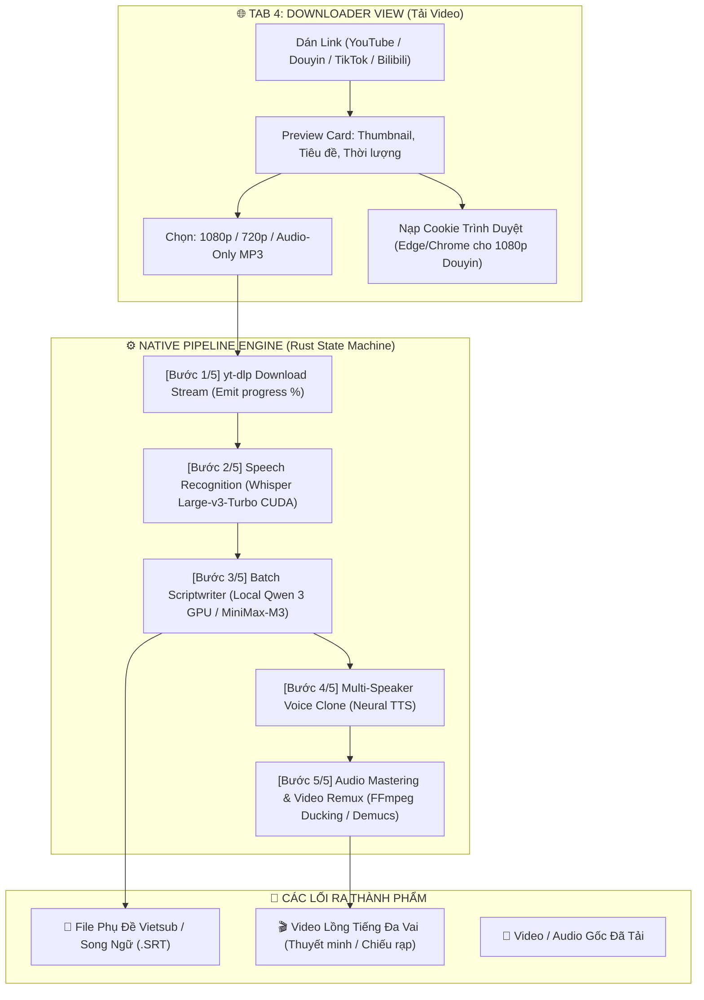

# KE_HOACH_ALL_IN_ONE_PIPELINE.md — Kế Hoạch Hệ Thống Video AI Tự Động Hóa Trọn Gói (Từ A Đến Z)

> **Tài liệu đặc tả kiến trúc & kế hoạch kỹ thuật dành riêng cho Agent Team (Antigravity & CommandCode) và Product Owner (Anh Tuấn - `jimmyvu`).**
> **Mục tiêu:** Xây dựng Tab Tải Video Đa Nền Tảng (Downloader) độc lập, kết hợp cùng **Native Pipeline Engine (Kiến trúc tự động hóa kiểu n8n viết thuần bằng Rust)** kết nối toàn bộ hệ thống từ: **Tải Video → Bóc Âm Thanh → Dịch Thuật → Lồng Tiếng Đa Vai → Xuất Video Thành Phẩm**.

---

## 🌟 1. Tầm Nhìn & Bối Cảnh (Vision & Problem Statement)

Hiện tại, Sublix đã sở hữu các khối chức năng lõi cực mạnh:
1. **STT Whisper Large-v3-Turbo CUDA**: Bóc băng giọng nói siêu tốc trên GPU RTX 3090.
2. **Local Qwen 3-4B GPU (CUDA) & MiniMax-M3**: Biên kịch và dịch thuật theo cụm (Batch Translation ~0.1s/câu).
3. **Studio Lồng Tiếng AI Đa Vai (AI Dubbing)**: Diarization phân vai, Neural TTS đa giọng điệu, Audio Ducking & Demucs v4 tách nhạc nền.
4. **File Subtitle Studio**: Tạo phụ đề rời `.srt` đơn ngữ và song ngữ.

Tuy nhiên, người dùng hiện tại vẫn phải tự tải video từ bên ngoài (qua trình duyệt/IDM), tìm file trên ổ cứng rồi mới kéo thả vào app.

### 🎯 Bước Nhảy Vọt:
Xây dựng một **Tab Tải Video Độc Lập** kết hợp **Bộ Điều Phối Quy Trình Tự Động (Native Pipeline Engine)**:
* **Đầu vào duy nhất:** Người dùng chỉ cần dán 1 đường link (YouTube, TikTok, Douyin, Bilibili, Facebook, X/Twitter, Kuaishou, Xiaohongshu...).
* **Đầu ra hoàn chỉnh:** 
  - Hoặc 1 video kèm file phụ đề Vietsub/Song ngữ `.srt`.
  - Hoặc 1 video lồng tiếng đa vai chuẩn điện ảnh/thuyết minh.
  - Hoặc cả hai (video lồng tiếng có kèm phụ đề).
* Mọi công đoạn trung gian đều được tự động hóa xuyên suốt, có thể chọn chế độ **1-Click Tự Động Hoàn Toàn** hoặc **Chế Độ Chuyên Nghiệp (Kiểm duyệt kịch bản từng bước)**.

---

## ⚖️ 2. So Sánh Kiến Trúc: Native Rust Pipeline vs n8n / Make.com

Nhiều hệ thống tự động hóa video AI trên thị trường hiện nay được dựng bằng **n8n** hoặc **Make.com**. Tuy nhiên, khi đưa vào ứng dụng Desktop Sublix, giải pháp Native Rust vượt trội hoàn toàn:

| Tiêu chí | 🌐 Hệ thống dựng bằng n8n | ⚡ Sublix Native Pipeline (Rust + Tauri) |
| :--- | :--- | :--- |
| **Kiến trúc & Cài đặt** | Cồng kềnh: Cần Node.js, Docker, Web Server, PostgreSQL | **Siêu gọn nhẹ:** Nhúng tĩnh 100% trong `sublix.exe`, 0 file rác |
| **Tận dụng GPU RTX 3090** | Khó khăn, phải gọi qua HTTP Webhook trung gian | **Native CUDA:** Gọi trực tiếp `whisper-cuda`, `llama-server` VRAM |
| **Độ trễ truyền dữ liệu** | Lâu (Upload/Download file qua các Node trung gian) | **0ms:** Truyền con trỏ bộ nhớ (RAM) và file path nội bộ |
| **Chi phí & Độ ổn định** | Phụ thuộc internet, server n8n có thể bị crash | **Chạy offline hoàn toàn** (khi dùng Local Qwen 3 GPU) |
| **Trải nghiệm người dùng** | Giao diện n8n rối rắm, người không rành code không dùng được | **Giao diện 1-Click Stepper** sang trọng, bấm 1 nút là chạy |

---

## 📋 3. Danh Sách Nền Tảng Hỗ Trợ Đầy Đủ

Sử dụng công cụ tải video `yt-dlp.exe` và `ffmpeg.exe` (tìm theo PATH hoặc thư mục kèm app — **KHÔNG hardcode đường dẫn máy cá nhân**, xem Mục 10).

> **⚠️ Phạm vi Phase 1 (điều chỉnh sau review):** chỉ làm trước **3 nền tảng: YouTube, TikTok, Douyin** cho thật chắc. Danh sách 15+ nền tảng dưới đây là **mục tiêu Phase 2** — mở rộng dần khi 3 nền đầu chạy ổn định.
>
> **⚠️ Nền tảng Trung Quốc hay chặn:** khi tải thất bại do bị chặn / thiếu đăng nhập / hết lượt, app phải **nói đúng nguyên nhân** ("Video này yêu cầu đăng nhập trình duyệt", "Bị chặn khu vực") kèm gợi ý xử lý — **cấm báo lỗi chung chung** hay im lặng bỏ qua.

### 🇨🇳 Nhóm 1: Hệ Sinh Thái Trung Quốc (Mỏ Vàng Kịch Ngắn, Anime, Review)
1. **Douyin (抖音)**: Video ngắn, đặc biệt là **Kịch ngắn (Mini Drama / Short Series)** đang cực kỳ viral. Tự động bóc tách và lồng tiếng tiếng Việt để đăng lại Shorts/Reels/TikTok.
2. **Bilibili (哔哩哔哩)**: Video dài, anime, bài giảng, review công nghệ. Hỗ trợ bốc tách cả phụ đề gốc (CC) của tác giả.
3. **Kuaishou (快手)**: Tiểu phẩm hài, đời sống thực tế nông thôn, video ngắn dân dã.
4. **Xiaohongshu (小红书 - RED)**: Video review thời trang, mỹ phẩm, ẩm thực, phong cách sống.
5. **Weibo Video (微博)**: Video tin tức, phỏng vấn nghệ sĩ, hậu trường giải trí.
6. **Xigua Video (西瓜视频)**: Phim tài liệu ngắn, video khoa học đời sống 5-15 phút của ByteDance.
7. **iQiyi (爱奇艺) & Youku (优酷)**: Trích đoạn phim bộ, show truyền hình thực tế.
8. **Ximalaya (喜马拉雅)**: Audio sách nói, podcast, truyện audio (rất thích hợp cho chế độ Audio-Only Dubbing).

### 🌍 Nhóm 2: Các Nền Tảng Quốc Tế & Phổ Thông
1. **YouTube & YouTube Shorts**: Hỗ trợ mọi độ phân giải (360p đến 4K), hỗ trợ trích xuất phụ đề tác giả có sẵn (Official Captions).
2. **TikTok (Quốc tế)**: Video dọc ngắn, chất lượng âm thanh gốc.
3. **Facebook & Facebook Reels**: Video bài đăng fanpage, video công khai.
4. **Instagram Reels & Video**: Clip sáng tạo, đời sống.
5. **X (Twitter)**: Video tin tức, clip thời sự nóng hổi.
6. **Reddit**: Tự động ghép luồng video và audio độc lập của Reddit thành file hoàn chỉnh.
7. **Twitch**: Clip tuyển chọn (Clips) và VODs phát lại của các streamer.

---

## 🏗️ 4. Kiến Trúc Chi Tiết: Tab Downloader & Native Pipeline Engine



---

## 💻 5. Đặc Tả Kỹ Thuật Tầng Rust (Backend State Machine)

Trong `src-tauri/src/downloader/pipeline.rs`, chúng ta xây dựng mô hình State Machine bất đồng bộ:

```rust
#[derive(Debug, Clone, Serialize, Deserialize)]
pub enum PipelineStage {
    Idle,
    Downloading { url: String, percent: f32, speed: String, eta: String },
    Transcribing { current_sec: f32, total_sec: f32, percent: f32 },
    Translating { current_batch: usize, total_batches: usize, percent: f32 },
    SynthesizingVoice { current_speaker: String, percent: f32 },
    RemuxingVideo { percent: f32 },
    Completed { output_path: String, duration_sec: f32 },
    Failed { error: String, stage_name: String },
    Cancelled,
}

#[derive(Debug, Clone, Serialize, Deserialize)]
pub struct PipelineProgressEvent {
    pub stage: PipelineStage,
    pub step_index: u8,    // 1..=5
    pub total_steps: u8,   // 5
    pub percent: f32,      // 0..=100
    pub message: String,
}
```

### Cơ Chế An Toàn & Hủy Bỏ Tức Thì (Instant Cancellation)
* Sử dụng `Arc<AtomicBool> CANCEL_TOKEN`.
* Tại mỗi bước (giữa các chunk download của `yt-dlp`, giữa các batch của Qwen 3, hoặc trong lúc FFmpeg chạy), Rust kiểm tra `cancel_token.load(Ordering::Relaxed)`.
* Nếu người dùng bấm `🛑 Dừng lại`: Tiến trình con bị kill ngay lập tức bằng `taskkill /F`, dọn sạch file tạm trong cache nội bộ.

---

## 🔒 6. Quyết Định Thiết Kế Đã Chốt (Decisions Locked - Anh Tuấn Duyệt 2026-10-04)

| Quyết định | Nội dung đã chốt | Ghi chú lộ trình (Phases) |
| :--- | :--- | :--- |
| **1. Thư mục tải về (Storage Scope)** | **Lưu trong phạm vi nội bộ của phần mềm** (`%APPDATA%/com.sublix.desktop/downloads`). Tránh xả rác ra ổ đĩa cá nhân của người dùng khi đang phát triển. | **Phase 1 (Hiện tại):** Lưu nội bộ ngầm.<br>**Phase 2 (Public Release):** Mở thêm nút chọn thư mục tùy ý (Custom Folder Picker). |
| **2. Cookie Trình duyệt (High Quality Douyin/Bilibili)** | **Có tích hợp cookie đăng nhập** để cẩu video độ nét cao nhất (1080p/4K) từ các nền tảng Trung Quốc (Douyin, Bilibili) và YouTube. | Hỗ trợ tự động trích xuất cookie từ Edge / Chrome (`--cookies-from-browser edge`) giúp video nét căng không bị bóp băng thông. |
| **3. Phụ đề rời vs Ghép chữ (Hardsub)** | **Trước mắt (Phase 1):** Tập trung xuất video gốc kèm file phụ đề rời `.srt` (Vietsub / Song ngữ) chuẩn timing.<br>**Nâng cao (Phase 2):** Nghiên cứu FFmpeg Burn-in Hardsub (ghép chữ cứng trực tiếp lên khung hình video). | **Phase 1:** File `.srt` rời chuẩn UTF-8.<br>**Phase 2:** FFmpeg Video Filter (`subtitles=...`) tùy chỉnh font chữ, màu sắc, viền bóng. |
| **4. Bản quyền & Trách Nhiệm (bổ sung sau review CommandCode)** | Trên màn hình Tải Video luôn có ghi chú: *"Chỉ tải và sử dụng nội dung bạn có quyền — khi đăng lại video đã lồng tiếng, người dùng tự chịu trách nhiệm về bản quyền và điều khoản nền tảng."* | Áp dụng ngay Phase 1. |

---

## 🚀 7. Phân Kỳ Phát Triển (Phase Roadmap)

### 🟠 Phase 0: Chữa Nền Móng (BẮT BUỘC — hoàn thành trước Phase 1)

Kế hoạch mới xây trên chính pipeline lồng tiếng hiện tại, mà phần này **đang có lỗi làm hỏng đầu ra**. Xây nhà trên nền nứt thì nhà mới cũng nứt — nên Phase 0 sửa trước:

1. **Sửa âm thanh:** `BUG-026` (phim dài quá ~900 câu là hỏng export) + `BUG-030` (âm lượng lúc to lúc nhỏ bất thường).
2. **Sửa việc "Dừng lại":** `BUG-027` + `BUG-028` + `BUG-041` — bấm Dừng là dừng ngay thật sự, không chạy lén tiếp, không bị 2 công việc giẫm nhau.
3. **Hỏng là phải la lên:** `BUG-029` — dịch lỗi mà âm thầm lồng tiếng gốc vào video là lỗi nguy hiểm nhất, cấm im lặng.
4. **Sửa File Studio:** `BUG-031` + `BUG-032` — đổi tab không mất việc, không nhân đôi dữ liệu, đang chạy mà thả file mới không làm hỏng tiến độ.

**Tiêu chí nghiệm thu Phase 0:** xuất thử 1 phim dài >900 câu; bấm Dừng thử ở **mọi** giai đoạn (tách giọng, dịch, lồng, ghép video) thấy dừng ngay; rút mạng giữa chừng thấy app **báo lỗi rõ ràng**; không có sản phẩm sai nào được sinh ra mà không cảnh báo.

### 🟢 Phase 1: MVP Trọn Gói Tải & Dịch Video (Triển khai ngay)
1. **Backend Rust `downloader/mod.rs`**:
   - Bọc `yt-dlp.exe` có sẵn, tải video/audio về cache nội bộ app.
   - Hỗ trợ cơ chế Cookie từ trình duyệt (`--cookies-from-browser edge`).
   - Emit event tiến trình `downloader:progress`.
2. **Giao diện Tab `DownloaderView.tsx` & `.css`**:
   - Thêm tab `🌐 Tải Video` vào Sidebar.
   - Ô dán link thông minh, xem trước Thumbnail, chọn chất lượng (1080p / 720p / Audio MP3).
3. **Cầu nối tự động (Pipeline Gateways)**:
   - Tải xong $\rightarrow$ Chuyển sang **File Sub** (tạo file `.srt` Vietsub).
   - Tải xong $\rightarrow$ Chuyển sang **AI Dubbing** (lồng tiếng đa vai, audio ducking / demucs).
4. **Chế độ 1-Click Auto Pipeline**:
   - Dán link $\rightarrow$ Tích chọn *"Tự động làm từ A đến Z"* $\rightarrow$ Chạy liên tục từ Step 1 đến Step 5.
5. **Chính sách "hỏng thì làm sao" (BẮT BUỘC — điều chỉnh sau review):**
   - Từng bước hỏng phải **hiện lên màn hình đúng nguyên nhân** kèm 2 lựa chọn: *"Thử lại bước này"* và *"Chạy tiếp từ bước sau"* — **tuyệt đối không im lặng bỏ qua**.
   - Tải dở do mạng rớt thì tải **tiếp từ chỗ dừng**, không bắt tải lại từ đầu.
   - Trước khi tải: kiểm tra ổ đĩa còn trống đủ không (video 4K có thể nặng vài chục GB).
   - Chế độ 1-Click hỏng bước nào: **dừng hẳn ở bước đó**, giữ nguyên mọi file đã làm được, cho người dùng chọn chạy tiếp hay thử lại.
   - Mọi sản phẩm làm dở phải ghi nhớ để mở app lên còn thấy "đang có việc dở dang", không mất trắng.
6. **Ghi chú bản quyền (BẮT BUỘC):** trên màn hình Tải Video có dòng chú ý rõ: *"Chỉ tải và sử dụng nội dung bạn có quyền. Khi đăng lại video đã lồng tiếng, người dùng tự chịu trách nhiệm về bản quyền và điều khoản của nền tảng."*

### 🟡 Phase 2: Bản Nâng Cao (Workflow Builder kiểu n8n)
1. **FFmpeg Burn-in Hardsub:** Ghép chữ cứng trực tiếp lên video với tùy chọn phong cách (Màu vàng rạp chiếu, viền đen, font chữ điện ảnh, vị trí canh lề).
2. **Workflow Recipe System:** Lưu các công thức dựng video mẫu (Ví dụ: Recipe *"Kịch Ngắn Douyin Vietsub"*, Recipe *"Podcast YouTube Thuyết Minh"*).
3. **Batch Downloader Queue:** Tải hàng loạt danh sách video / toàn bộ playlist hoặc kênh TikTok/Douyin chạy qua đêm.
4. **Bộ chọn thư mục xuất bản:** Cho phép người dùng tùy chọn lưu ra Desktop / Thư mục tải về riêng khi public ra cộng đồng.

---

## 👥 8. Phân Công Trách Nhiệm Trong Agent Team

| Agent | Nhiệm vụ chính | Output bàn giao |
| :--- | :--- | :--- |
| **Antigravity** | Xây dựng Backend Rust `downloader/mod.rs`, Tauri commands, Frontend UI `DownloaderView.tsx`, CSS Glassmorphism, Navigation Bridge chuyển tab | Code backend + frontend hoàn chỉnh, test build release |
| **CommandCode** | Review kiến trúc, audit luồng hủy tiến trình (Job Object cho yt-dlp), kiểm tra regex stdout progress, bảo mật cookie path | Báo cáo review, đóng góp fix code nếu có lỗ hổng |
| **Anh Tuấn (`jimmyvu`)** | Product Owner, kiểm thử thực tế trên các link Douyin, YouTube, TikTok yêu thích | Đánh giá UX, nghiệm thu tính năng |

---

## 🔍 9. Khu Vực Dành Riêng Cho CommandCode Đánh Giá (Reviewer Section)

Kính mời **CommandCode** vào kiểm tra và đóng góp ý kiến cho các câu hỏi kỹ thuật sau:
1. **Regex phân tích tiến trình stdout của `yt-dlp`:** Chúng ta nên dùng regex parse trực tiếp stdout hay dùng cờ `--progress-template "%(progress._percent_str)s %(progress._speed_str)s %(progress._eta_str)s"` để parse JSON/chuẩn định dạng an toàn hơn?
2. **Cơ chế Cookie:** Khi gọi `--cookies-from-browser edge`, trên Windows có cần lưu ý quyền truy cập file SQLite cookie của Edge nếu trình duyệt đang mở không? (Có cần copy file cookie tạm thời trước khi đọc?).
3. **Quản lý Process Tree:** Đảm bảo khi kill `yt-dlp` thì không để lại tiến trình ma `ffmpeg` đang remux dở.

---

## 🧑‍⚖️ 10. Review Của CommandCode (2026-10-04)

**Kết luận:** Kế hoạch **đúng hướng và nên làm** — Native Rust là lựa chọn chuẩn cho desktop, State Machine rõ ràng, 3 quyết định đã chốt (storage nội bộ → Phase 2 mở rộng, cookie trình duyệt, SRT rời trước – hardsub sau) đều hợp lý. Có **4 điểm bắt buộc bổ sung trước khi code Phase 1**:

1. **KHÔNG lặp lại thiết kế hủy tiến trình cũ:** Mục 5 mô tả `Arc<AtomicBool> CANCEL_TOKEN` + `taskkill /F` — đúng y pattern vừa gây `BUG-027`/`BUG-028` và `BUG-003`. Thay bằng **run-generation (`AtomicU64`) + Windows Job Object `KILL_ON_JOB_CLOSE`** cho mọi tiến trình con (lưu ý: `yt-dlp` kéo theo cả `ffmpeg` bên trong).
2. **Bỏ đường dẫn hardcode `C:\Program Files\AI Automation\bin\yt-dlp.exe` (Mục 3):** lặp lại `BUG-001`/`BUG-017`. Resolve theo thứ tự: PATH → thư mục cạnh `sublix.exe` (đóng gói kèm bản portable) → config do người dùng chỉ.
3. **Chính sách vận hành Phase 1 cần đủ:** dọn cache `downloads/` (giới hạn dung lượng/tuổi file), kiểm tra dung lượng đĩa trước khi tải 4K, cho phép resume tải dở (`.part` của yt-dlp), chính sách lỗi từng bước của 1-Click (dừng hay bỏ qua bước hỏng), và **ghi chú pháp lý trong UI**: chỉ tải nội dung người dùng có quyền sử dụng (điều khoản nền tảng & bản quyền).
4. **State Machine nên thêm:** `Retrying { attempt, max }` và **ghi state xuống đĩa** để app crash/restart vẫn biết job nào đang dở; trước khi Step 5 dùng lại Dubbing export cần fix `BUG-026`/`BUG-030` (amix) và `BUG-029` (fallback dịch lồng tiếng gốc).

### Trả lời 3 câu hỏi kỹ thuật (Mục 9)
1. **Parse tiến trình yt-dlp:** Dùng `--newline --no-ansi --progress-template "download:%(progress.downloaded_bytes)s|%(progress.total_bytes)s|%(progress.total_bytes_estimate)s|%(progress.speed)s|%(progress.eta)s"` rồi tách theo ký tự phân cách — **KHÔNG regex stdout chữ tự do** và tránh `%(progress._percent_str)s` (chứa ANSI/khoảng trắng, đổi theo version). Tự tính `%` từ byte để UI ổn định.
2. **Cookie trình duyệt:** (a) file SQLite `Cookies` của Edge bị khóa WAL khi trình duyệt đang mở → copy `Cookies` + `-wal` + `-shm` về thư mục tạm trước khi đọc; (b) Edge/Chrome bản mới dùng **App-Bound Encryption** khiến giải mã cookie thất bại trên một số máy → bắt buộc có đường fallback `--cookies cookies.txt` (Netscape, người dùng export từ extension) và báo lỗi rõ ràng; (c) cookie = toàn quyền tài khoản → chỉ lưu trong `%APPDATA%` nội bộ app, không log, không upload.
3. **Quản lý cây tiến trình:** `yt-dlp` spawn `ffmpeg` (ghép H.264+AAC) — kill `yt-dlp` vẫn để lại `ffmpeg` mồ côi. Bắt buộc đưa cả cây vào **Windows Job Object `KILL_ON_JOB_CLOSE`** (giống giải pháp `BUG-002`); phương án dự phòng `taskkill /PID <pid> /T /F` (giết cây theo PID — **cấm `/IM` theo tên**, `BUG-003`). Tuyệt đối không dùng `taskkill /F` mù như đề xuất ban đầu của Mục 5.

---

## ✅ 11. Danh Sách Việc Antigravity Cần Làm (Làm đúng theo thứ tự)

1. **Phase 0 — Chữa nền móng** (Mục 7): sửa `BUG-026`, `BUG-030`, `BUG-027`, `BUG-028`, `BUG-041`, `BUG-029`, `BUG-031`, `BUG-032` (chi tiết `ISSUE_LOG.md`). **Nghiệm thu đủ tiêu chí Phase 0 mới được qua bước 2.**
2. **Tab Tải Video (3 nền tảng: YouTube, TikTok, Douyin):** ô dán link + xem trước + chọn chất lượng + nút Tải. Làm theo phần kỹ thuật Mục 5 & trả lời Mục 10 (đọc tiến trình bằng `--progress-template`, **không regex**; đường dẫn yt-dlp theo PATH/cạnh exe; kế thừa mã nguồn từ `hermes-downloader`).
3. **Chính sách "hỏng thì làm sao"** (Phase 1 mục 5): lỗi hiện đúng nguyên nhân + nút "Thử lại" / "Chạy tiếp", tải dở được tải tiếp, kiểm tra dung lượng ổ đĩa trước khi tải.
4. **Chế độ 1-Click A→Z:** nối Tải → File Sub → Lồng tiếng, có nút Dừng **thật sự** (Job Object diệt cả cây tiến trình — mục 10 câu 3) và ghi nhớ việc dở dang khi mở app lại.
5. **Ghi chú bản quyền** trên màn hình Tải Video (Quyết định số 4).
6. **Chưa làm trong Phase 1:** các nền Trung Quốc còn lại, hardsub, tải hàng loạt, recipe workflow — để hết Phase 2.

**Luật chung khi code:** mọi tiến trình con phải sống chết theo app (Job Object); mọi hỏng hóc phải hiện lên màn hình; **cấm im lặng** bỏ qua hoặc thay thế kết quả sai mà không báo.

---

## 💎 12. Kế Thừa & Tái Sử Dụng Mã Nguồn Từ `hermes-downloader` (Tiết Kiệm 80% Công Sức)

Theo phát hiện và chỉ đạo của anh Tuấn, trong thư mục `H:\AI Project\hermes-downloader` đã có sẵn một dự án Downloader hoàn chỉnh và đã được kiểm thử thực tế. Thay vì viết lại từ đầu 100%, chúng ta sẽ **kế thừa trực tiếp các tài sản quý giá sau**:

### A. Tầng Logic & Tham Số `yt-dlp` (Chuyển thể sang Rust):
1. **Bộ nhận diện nền tảng (`getPlatform` trong `hermes-downloader/main.js:89-106`):**
   - Đã có sẵn toàn bộ regex nhận diện chuẩn xác: YouTube, TikTok, Facebook, X (Twitter), Instagram, Vimeo, SoundCloud, Reddit, Twitch, Bilibili...
   - Chuyển thẳng regex này sang hàm Rust `detect_platform(url: &str) -> Platform`.
2. **Bộ tham số định dạng (`buildFormatArgs` trong `hermes-downloader/main.js:418-429`):**
   - Đã tinh chỉnh cờ format tối ưu:
     - `audio-mp3`: `["-x", "--audio-format", "mp3", "--audio-quality", "0"]`
     - `audio-m4a`: `["-x", "--audio-format", "m4a", "--audio-quality", "0"]`
     - `720p`: `["-f", "best[height<=720]/best"]`
     - `1080p`: `["-f", "best[height<=1080]/best"]`
     - `4K`: `["-f", "best[height>=2160]/best[height>=1440]/best"]`
3. **Bộ cờ chống Rate-limit YouTube (`main.js:630-638`):**
   - `--extractor-args youtube:player_client=web_safari,android_vr,ios` (vượt qua cơ chế bóp băng thông của YouTube).
   - `--merge-output-format mp4` (tự động ép ghép video H.264 và audio AAC vào container MP4 chuẩn).
4. **Bộ cờ trích xuất phụ đề tự động (`main.js:642-649`):**
   - `--write-subs --write-auto-subs --convert-subs srt --sub-langs vi,en,ja,zh`.
5. **Cơ chế quét tìm binary `yt-dlp.exe` (`findYtDlpBinary` trong `main.js:401-412`):**
   - Đã lập sẵn danh sách các đường dẫn ưu tiên trên Windows: PATH $\rightarrow$ `C:\Program Files\AI Automation\bin\yt-dlp.exe` $\rightarrow$ AppData Python Scripts.

### B. Tầng Giao Diện UI/UX (Chuyển thể sang React + CSS Sublix):
1. **Bảng màu & Biểu tượng Platform (`PLATFORM_LABELS` trong `hermes-downloader/renderer/app.js:64-77`):**
   - Đã định nghĩa màu sắc thương hiệu, icon và badge chuẩn cho từng mạng xã hội.
2. **Các hàm tiện ích format (`formatBytes`, `formatSpeed`, `formatTime` trong `app.js:15-30`):**
   - Đã định dạng tiếng Việt chuẩn: `MB/s`, `GB`, `KB`.
3. **Thẻ Card Preview & Thanh tiến trình:**
   - Kế thừa cấu trúc CSS và layout thẻ download trong `hermes-downloader/renderer/style.css`.

---

*Tài liệu được cập nhật chính thức vào Git repo `master` ngày 2026-10-04 — Đã tích hợp tài sản tái sử dụng từ `hermes-downloader` theo chỉ đạo của Anh Tuấn!*

