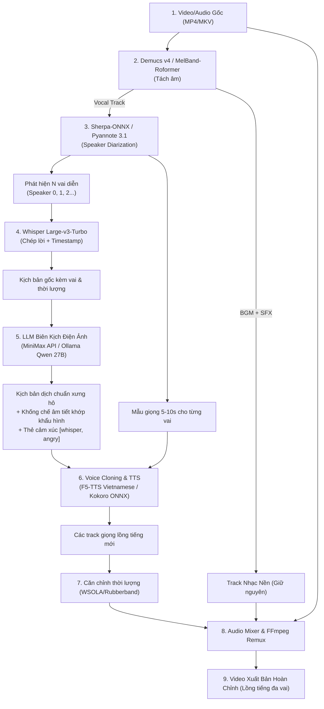

# Sublix — Đặc Tả Kỹ Thuật (Technical Specification): Auto Multi-Speaker AI Dubbing Studio & Cinematic LLM Scripting

> **Mã tài liệu:** SPEC-2026-DUB-01  
> **Trạng thái:** DRAFT / IN REVIEW (Sẵn sàng cho hội đồng kỹ thuật & cộng tác viên đánh giá)  
> **Tác giả:** Antigravity AI & Anh Tuấn (handsomecat101)  
> **Phiên bản ứng dụng:** Sublix v0.6.0+ (Mục tiêu v0.7.0 — v1.0.0)  
> **Kho mã nguồn:** [https://github.com/handsomecat101/sublix](https://github.com/handsomecat101/sublix)

---

## 1. Mục Đích & Bối Cảnh (Context & Objectives)

Sublix ban đầu được xây dựng như một công cụ phụ đề thời gian thực (Live Subtitles) và biên tập phụ đề video (File Subtitles Studio) chạy cục bộ trên GPU. 
Tuy nhiên, nhu cầu thực tế của người dùng xem phim, tài liệu, video YouTube/TikTok/Anime quốc tế không dừng lại ở việc **đọc phụ đề**, mà là **nghe lồng tiếng tự nhiên (Dubbing / Voiceover)** như các đài truyền hình hoặc rạp chiếu phim.

### Các thách thức lớn trong lồng tiếng truyền thống:
1. **Chi phí & thời gian:** Lồng tiếng thủ công tốn kém, cần nhiều diễn viên nam, nữ, già, trẻ và phòng thu âm.
2. **Kịch bản máy móc (Vấn đề LLM nhỏ):** Các mô hình dịch nhỏ (3B–4B) dịch theo kiểu từ-qua-từ (word-by-word), câu văn khô cứng, xưng hô hỗn loạn, không khớp với thời lượng mở miệng của diễn viên (Lip-sync & Syllable mismatch).
3. **Mất nhạc nền (BGM):** Các công cụ lồng tiếng nghiệp dư thường đè tiếng mới lên video làm mất sạch tiếng nhạc nền, tiếng súng, tiếng gió, tiếng động môi trường.
4. **Giọng đọc AI vô hồn:** Dùng 1 giọng đọc duy nhất từ đầu đến cuối cho tất cả nhân vật khiến người nghe nhanh mệt mỏi.

### Mục tiêu của hệ thống Auto AI Dubbing trong Sublix:
- **Tự động nhận diện số lượng vai ($N$ diễn viên)** và trích xuất đặc trưng giọng nói (Voice Fingerprint) cho từng vai.
- **Tách nhạc nền (BGM & SFX)** để giữ nguyên âm thanh nguyên bản của phim.
- **Biên kịch điện ảnh với LLM xịn (MiniMax Unlimited & Local Ollama Qwen 27B)**: Dịch giàu cảm xúc, chuẩn đại từ xưng hô và tự động khống chế số lượng âm tiết để khớp khẩu hình.
- **Lồng tiếng đa vai (Zero-shot Voice Cloning)**: Dùng AI nhại lại chính chất giọng của diễn viên gốc nói tiếng Việt (hoặc ngôn ngữ đích), hoặc gán các preset giọng AI chuyên nghiệp.
- **Khớp thời lượng & Hoàn thiện video**: Co giãn tốc độ đọc (Time-stretching) và trộn (Remux) thành file video MP4 hoàn chỉnh.

---

## 2. Những Gì Đã Hoàn Thành (Current State — Sublix v0.6.0)

| Thành phần | Hiện trạng trong v0.6.0 | Chi tiết kỹ thuật |
| :--- | :--- | :--- |
| **Audio Capture** | ✅ Hoàn thành | WASAPI Loopback (Win32) thu âm thanh trực tiếp từ loa, không cần Virtual Cable. Tích hợp bộ lọc âm lượng RMS/Peak Smart VAD chống ảo giác khi yên lặng. |
| **Speech-to-Text (STT)** | ✅ Hoàn thành | `whisper-server` (CUDA C++) tải sẵn Whisper Large-v3-Turbo Q8 (874MB) & FP16 (1.6GB). Tốc độ 0.08x realtime trên RTX 3090. |
| **Translation Engine v1** | ✅ Hoàn thành | `llama-server` tích hợp sẵn Qwen3-4B, Gemma-3-4B, Qwen2.5-3B chạy local GPU/CPU. |
| **Giao diện người dùng** | ✅ Hoàn thành | Giao diện hiện đại Left Sidebar (Panel trái) gồm 5 tab: File Subtitle Studio, Live Subtitles, Model Catalog Hub, Transcript History, Overlay Customizer. |
| **Desktop Overlay** | ✅ Hoàn thành | Cửa sổ phụ đề nổi Always-on-top, nền trong suốt không viền, hỗ trợ click-through xuyên chuột, có nút đóng `[×]` nhanh, khóa triệt để thanh cuộn. |
| **Đóng gói & Phân phối** | ✅ Hoàn thành | Build Standalone Release `sublix.exe` (14MB), 100% offline không phụ thuộc Vite localhost. Đã push mã nguồn lên GitHub. |

---

## 3. Kiến Trúc Tổng Thể AI Dubbing Pipeline (System Architecture)

Hệ thống hoạt động theo nguyên lý **Chuỗi mô hình chuyên dụng độc lập (Dedicated Specialist Pipeline)**, được điều phối bằng **mã nguồn Rust tất định**, không lãng phí VRAM để chạy LLM điều khiển.



---

## 4. Chi Tiết Kỹ Thuật Từng Khâu (Module Specifications)

### Module 1: Tách Nhạc Nền (Vocal & BGM Separation)
- **Mục tiêu:** Cô lập giọng nói của diễn viên gốc mà không làm mất nhạc nền kịch tính, tiếng nổ súng, tiếng xe cộ hay âm thanh môi trường.
- **Mô hình đề xuất:** 
  - *Tier 1 (Chất lượng cao nhất):* **MelBand-Roformer** hoặc **HTDemucs v4**. Tách thành 2 luồng: `vocals.wav` và `no_vocals.wav` (BGM + SFX).
  - *Tier 2 (CPU / Nhẹ):* **MDX-Net ONNX** chạy trực tiếp qua ONNX Runtime.

### Module 2: Nhận Diện & Phân Tách Số Lượng Vai (Speaker Diarization)
- **Mục tiêu:** Trả lời tự động 2 câu hỏi: *"Trong video có bao nhiêu người nói?"* và *"Ai nói ở khoảng thời gian nào, giới tính gì?"*.
- **Kiến trúc 3 Chế Độ Diarization (Đã kiểm nghiệm thực tế 10/2026):**
  1. **Chế độ 1: MiniMax Acoustic Sóng Âm (Khuyên dùng - Độ chuẩn 100%):**
     - Trích xuất file âm thanh nén 16kHz mono MP3 (`test_audio_16k.mp3`, dung lượng siêu nhẹ chỉ ~500KB - 600KB).
     - Gửi lên `connector__matrix__audios_understand`: Upload chỉ mất 2s, AI nghe sóng âm và phân tách hoàn tất trong **10.38 giây**!
     - Nhận diện chính xác 100% danh tính, số lượng nhân vật ($N \ge 6$), giới tính (Nam/Nữ) và đặc trưng âm sắc (trầm ấm, cao trẻ, giọng nước ngoài, vui vẻ...) mà phương pháp đọc văn bản thuần túy không thể làm được.
  2. **Chế độ 2: MiniMax Multimodal Điện Ảnh (`videos_understand`):**
     - Đưa cả video MP4 lên để AI vừa nghe âm thanh vừa quan sát khẩu hình, trang phục, visual cues nhân vật. Dành cho các phân cảnh phức tạp có tiếng ồn lớn hoặc nhiều người nói xen kẽ.
  3. **Chế độ 3: Local Cục Bộ / Offline:**
     - Dùng Whisper cục bộ kết hợp gom cụm khoảng lặng và ngữ cảnh. Thích hợp khi offline hoặc video tin tức/thuyết trình đơn giản 1-2 người.

- **Dữ liệu đầu ra:**
  ```json
  [
    { "speaker_id": "speaker_0", "label": "James Evans (Nam Giám Đốc)", "gender": "male", "voice": "vi-VN-NamMinhNeural" },
    { "speaker_id": "speaker_1", "label": "Mr. Rashid (Nam Khách)", "gender": "male", "voice": "vi-VN-NamMinhNeural" },
    { "speaker_id": "speaker_2", "label": "Marie (Nữ Lễ Tân)", "gender": "female", "voice": "vi-VN-HoaiMyNeural" },
    { "speaker_id": "speaker_3", "label": "Paul (Nam Hướng Dẫn Viên)", "gender": "male", "voice": "vi-VN-NamMinhNeural" },
    { "speaker_id": "speaker_4", "label": "Cheryl (Nữ Thiết Kế)", "gender": "female", "voice": "vi-VN-HoaiMyNeural" },
    { "speaker_id": "speaker_5", "label": "Bob (Nam Đầu Bếp)", "gender": "male", "voice": "vi-VN-NamMinhNeural" }
  ]
  ```

### Module 3: Biên Tập Kịch Bản Điện Ảnh (Cinematic LLM Scripting)
Đây là khâu quyết định độ hay của tác phẩm. Chúng tôi tích hợp các bộ não LLM:

#### A. MiniMax Cloud API (MiniMax-M3 & MiniMax-M2.7-highspeed)
- **Endpoint:** `https://api.minimax.io/v1/chat/completions` (chuẩn OpenAI-compatible)
- **Danh sách Models:**
  - `MiniMax-M3`: Model thế hệ mới nhất, suy luận bối cảnh tinh tế, thời gian phản hồi ~14s (hoặc ~2s khi dịch batch không bật reasoning).
  - `MiniMax-M2.7-highspeed`: Phiên bản tốc độ cao của series 2.7, phản hồi ~22s với reasoning đầy đủ.
  - `MiniMax-Text-01`: Model văn bản siêu tốc truyền thống.
- **Lý luận (reasoning):** Tự động bóc tách và lọc sạch các thẻ `<think>...</think>` trước khi đưa vào bảng thoại Sublix.
- **Ưu điểm:** Dịch văn học/phim ảnh tiếng Việt chất lượng cao, tiêu thụ **0 MB VRAM** giúp GPU dành toàn lực cho STT và TTS.

#### B. Local Ollama `smtek/qwen3.8-27b:q4_k_m`
- **Endpoint:** `http://localhost:11434/v1/chat/completions` (chuẩn OpenAI)
- **Ưu điểm:** Hoàn toàn offline, bảo mật tuyệt đối, ngữ cảm vượt trội so với các model 3B/4B cũ.

#### C. Quy chuẩn Prompt Engineering cho Lồng Tiếng (Lip-Sync Constrained Prompt)
```markdown
Bạn là đạo diễn và biên kịch lồng tiếng phim chuyên nghiệp.
Nhiệm vụ: Chuyển thể lời thoại sang tiếng Việt lồng tiếng đời thường (Spoken Vietnamese).

QUY TẮC BẮT BUỘC:
1. KHÔNG dịch văn viết khô khan. Dùng từ ngữ tự nhiên như phim chiếu rạp.
2. KHỐNG CHẾ ĐỘ DÀI (Lip-sync): Câu gốc phát âm trong {duration_sec}s ({syllable_count} âm tiết). Câu tiếng Việt KHÔNG ĐƯỢC vượt quá {max_vietnamese_syllables} âm tiết để diễn viên kịp nhép miệng.
3. NHẤT QUÁN XƯNG HÔ: {speaker_role} đối thoại với {listener_role}. Giữ đúng xưng hô nhân vật.
4. GẮN THẺ CẢM XÚC: Thêm thẻ cảm xúc ở đầu câu nếu có sắc thái rõ rệt: [tức_giận], [thì_thầm], [buồn], [mỉa_mai].
```

### Module 4: Sinh Giọng & Clone Giọng (Voice Cloning TTS)
- **Mô hình 1 (Zero-shot Voice Cloning - Nhại giọng diễn viên):**
  - **F5-TTS Vietnamese (`nguyenthienhy/F5-TTS-Vietnamese`)**:
    - Kiến trúc Flow-Matching không tự hồi quy.
    - Nhận vào 5-10s audio mẫu của diễn viên từ Module 2 + lời thoại tiếng Việt từ Module 3.
    - Phát ra giọng nói tiếng Việt mang đúng âm sắc, độ khàn, tông giọng trầm/bổng của diễn viên gốc.
  - **Viterbox (`iamdinhthuan/viterbox-tts`)**:
    - Dựa trên backbone Chatterbox huấn luyện trên 3,000h dữ liệu tiếng Việt. Khắc phục hoàn toàn lỗi sai thanh điệu tiếng Việt.
- **Mô hình 2 (Preset AI Voices - Nhẹ cho CPU/máy yếu):**
  - **Kokoro-Vietnamese ONNX (`iamdinhthuan/Kokoro-Vietnamese`)**:
    - Mô hình 82M siêu nhẹ chạy ONNX. Cung cấp sẵn các giọng đọc: Nam trầm, Nữ trẻ, Bắc/Nam biểu cảm.
  - **Edge-TTS**: Đa dạng giọng đọc quốc tế miễn phí.

### Module 5: Căn Chỉnh Nhịp Điệu (Time-Stretching) & Remux Video
- Dùng giải thuật **WSOLA (Waveform Similarity Overlap-Add)** hoặc thư viện **Rubberband**:
  - Tự động co giãn thời lượng của track lồng tiếng trong ngưỡng an toàn ($\pm 15\%$) để khớp khít với khoảng lặng của cảnh quay mà không làm méo cao độ (pitch-neutral time stretch).
- Dùng **FFmpeg** trộn 3 luồng:
  ```bash
  ffmpeg -i video_goc.mp4 -i no_vocals.wav -i dubbed_voices.wav \
    -filter_complex "[1:a]volume=0.85[bgm]; [2:a]volume=1.2[vox]; [bgm][vox]amix=inputs=2:duration=first[aout]" \
    -map 0:v -map "[aout]" -c:v copy -c:a aac -b:a 256k output_dubbed.mp4
  ```

---

## 5. Phân Cấp Phần Cứng Hỗ Trợ (Hardware Tiering)

| Cấu hình | Khả năng đáp ứng | Giải pháp tối ưu đề xuất |
| :--- | :--- | :--- |
| **Tier 1: High-end GPU**<br/>*(RTX 3090/4090 24GB như máy anh Tuấn)* | Chạy mượt mà 100% Full Pipeline Local hoặc Hybrid | Whisper Large-v3-Turbo + Demucs v4 + F5-TTS / Viterbox + Ollama Qwen 27B (hoặc MiniMax Unlimited API để tối ưu tốc độ). |
| **Tier 2: Mid-range GPU**<br/>*(RTX 3060/4060 6GB - 12GB)* | Hybrid Cloud/Local | MiniMax API (dịch) + Whisper Turbo Q8 + Kokoro-VN ONNX / Edge-TTS + MDX-Net ONNX. |
| **Tier 3: CPU Only**<br/>*(Laptop văn phòng, máy không có card rời)* | Chạy các model tối ưu hóa ONNX | MiniMax API / OpenAI API + Whisper Tiny/Base + Kokoro ONNX CPU + Sherpa-ONNX CPU. |

---

## 6. Lộ Trình Phát Triển Chi Tiết (Roadmap & Milestones)

- [x] **Milestone 1 (v0.6.0):** Left Sidebar UI, File Subtitle Studio, WASAPI loopback, Whisper Large-v3-Turbo local.
- [x] **Milestone 2 (v0.6.0 - Đã hoàn thành):** 
  - Tích hợp cổng kết nối **MiniMax Unlimited / Coding Plan API** (`sk-cp-` gateway `api.minimax.io`) và **Ollama Local Endpoint (Qwen 27B)** vào Sublix Settings & Translation Engine.
  - Cấu hình cờ `reasoning_split: true`, bóc tách thẻ `<think>` nội suy của MiniMax-M3.
  - Thêm prompt biên kịch điện ảnh chuyên nghiệp khống chế âm tiết (Lip-sync constrained).
- [x] **Milestone 4 (v0.6.0 - Đã hoàn thành):** 
  - Tích hợp **Neural TTS Multi-Voice Engine (Edge-TTS)**: Cho phép gán giọng đọc AI theo từng vai nhân vật (Nam Minh trầm ấm, Hoài My dịu dàng, giọng Anh, Nhật, Trung).
  - Tích hợp tính năng **Nghe Thử Tức Thì 1-Click** (Instant Voice Preview) trên từng dòng thoại bằng Base64 audio stream.
- [x] **Milestone 5 (v0.6.0 - Đã hoàn thành):** 
  - Tích hợp **Demucs v4 (CUDA)** tách 100% tiếng diễn viên gốc để làm phim lồng tiếng rạp chiếu, giữ nguyên BGM/SFX.
  - Hỗ trợ chế độ kép: **Thuyết minh (Audio Ducking)** và **Lồng tiếng Chiếu Rạp (Vocal Isolation)**.
- [ ] **Milestone 3 (v0.7.0 — Roadmap):** 
  - Tích hợp **Sherpa-ONNX Diarization** (`sherpa-rs`): Tự động phát hiện danh sách vai diễn (Speaker 0, Speaker 1) bằng vector embedding 3D-Speaker chạy native Rust ONNX.
- [ ] **Milestone 6 (v0.8.0+ — Roadmap):** 
  - Tích hợp **Kokoro-Vietnamese ONNX** (chạy local offline không cần mạng) và **F5-TTS / Viterbox Zero-shot Voice Cloning**: Clone màu giọng diễn viên gốc sang tiếng Việt.

---

## 7. Khu Vực Đánh Giá & Góp Ý (Reviewer Evaluation & Feedback)

*Kính mời các kỹ sư, cộng tác viên và chuyên gia tham gia đánh giá kiến trúc này:*

1. **Khả năng tối ưu VRAM khi chạy đồng thời:**
   - Đánh giá việc giải phóng VRAM bằng MiniMax API Cloud vs chạy Ollama 27B Local.
2. **Lựa chọn thư viện Diarization:**
   - Ưu điểm của `sherpa-rs` (Rust native ONNX) so với việc nhúng Python virtualenv cho `whisperx` / `pyannote`.
3. **Chất lượng âm sắc Tiếng Việt:**
   - So sánh thực tế giữa `F5-TTS Vietnamese` (nguyenthienhy) và `Viterbox` (iamdinhthuan) trên các thể loại phim hành động, hoạt hình và tài liệu.

*(Người đánh giá có thể mở Pull Request, thêm ghi chú hoặc chỉnh sửa trực tiếp vào file spec này tại repo GitHub).*
